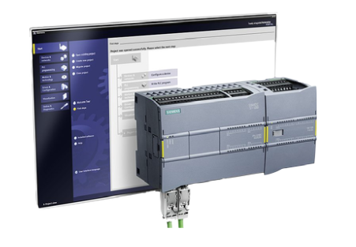
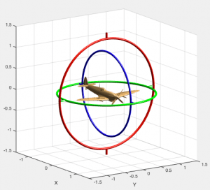
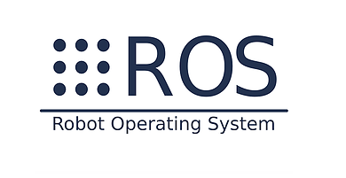

# AUTOMATIZACIÓN Y ROBÓTICA

Repositorio para las prácticas y problemas realizados en la asignatura de Automatización y Robótica.

## Prácticas realizadas

- Problemas de automatización usando PLCs empleando KOP.

    

- Problemas de cinemática robótica con MatLab.

    

- Creación y manejo de robots mediante ROS (python).

    

## Problemas teóricos realizados

- Problemas de automatización
- Problemas de cálculo de la cinemática de 2 robots (el primeo mediante transformaciones de los sistemas de coordenadas
siguiendo el algoritmo de Denavit-Hartenberg y el segundo por métodos geométricos).

## Autor

- [@Javiiiis](https://www.github.com/Javiiiis)

## Licencia

[MIT](https://choosealicense.com/licenses/mit/)
